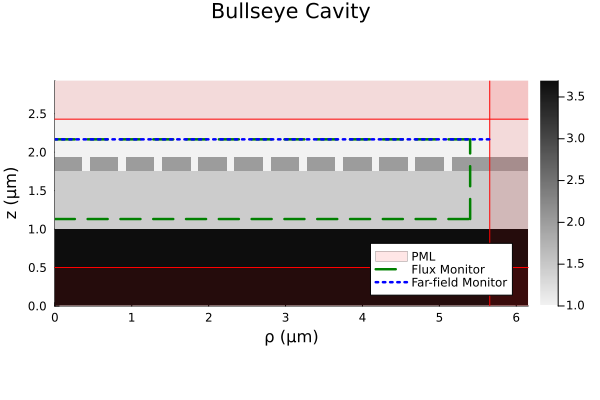
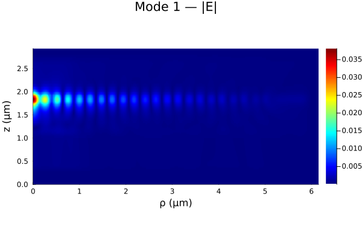
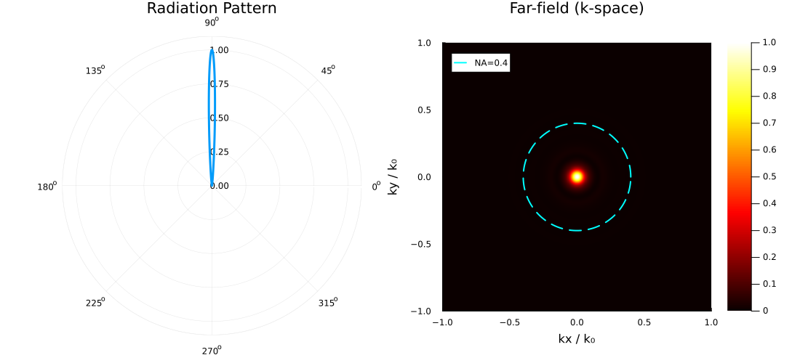

# BullseyeFDFD

A cylindrical FDFD solver for (inverse) designing, simulating, and optimizing Bullseye (Circular Bragg Grating) cavities.

<p align="center">
  
  
</p>

## Installation
In Julia's REPL:
```julia
using Pkg
Pkg.add(url="https://github.com/msanch23/BullseyeFDFD.git")
```
Requires Julia ≥ 1.12.

## Status / Scope
- [X] Forward simulation + modal/driven analysis
- [X] Convergence + Time/Ram curves — [view the convergence study](validation/convergence/simulation_convergence.ipynb)
- [X] COMSOL Validation
- [ ] Adjoint Optimization
- [ ] Add examples of published papers
- [ ] Experimental Validation

## Features
- Cylindrical (ρ,z) FDFD with azimuthal mode number m
- Conformal Auto-Meshing
- Subpixel-Smoothed Materials
- Stretched Coordinate-Perfectly Matched Layers (SC-PMLs)
- Eigenmode solver
- Driven-dipole solver

## Usage
### Bullseye Design
The eye, trenches, rings, and buffer are each a radial __width__ (μm), laid down outward from the center (ρ=0).
So the whole cavity is one vector:
```julia
design = [0.355000,             # eye
          0.100000, 0.370000,   # trench 1, ring 1
          0.100000, 0.370000,   # trench 2, ring 2
          0.100000, 0.370000,   # trench 3, ring 3
          0.100000, 0.370000,   # trench 4, ring 4
          0.100000, 0.370000,   # trench 5, ring 5
          0.100000, 0.370000,   # trench 6, ring 6
          0.100000, 0.370000,   # trench 7, ring 7
          0.100000, 0.370000,   # trench 8, ring 8
          0.100000, 0.370000,   # trench 9, ring 9
          0.100000, 0.370000,   # trench 10, ring 10
          0.100000];            # buffer
```
To turn the design into a geometry, we need to specify materials and thicknesses for both the cavity and substrates:
```julia
nClad = 1.00;
nSiN  = 2.01066;
nSiO2 = 1.45375;
nSi   = 3.69476 - 1im*0.00482; # Note the -i for loss

tCBG  = 0.17886;
tSiO2 = 0.75057;

substrates = [(n = nSiO2,   height = tSiO2), 
              (n = nSi,     height = Inf)];

geometry = build_geometry(design, substrates, nClad, nSiN, tCBG);
```
For a slotted cavity, pass `slotted=true`; the first entry is then the central slot width, i.e. `design = [slot, eye, trench1, ring1, …, buffer]`.

### Mesh & Visualization
To mesh the geometry, we need to specify a target λ since `conformal_grid()` calculates the size of the cell based on the simulation wavelength:
```julia
λ0 = 0.780;
grid = conformal_grid(geometry, λ0);
```
Then we can paint the Bullseye geometry on to the grid, and plot the cross-section for verification:
```julia
ϵ = build_epsilon(geometry, grid);

show_sim(ϵ, grid);
```
Which should produce a cross-section plot of the Bullseye geometry:
<p align="center">
  
</p>

### Solving & Analysis
#### Eigenfrequency
For solving the eigenfrequency, we just have to specify `Nmodes`:
```julia
sim = solve_sim(grid, ϵ, λ0;
                Nmodes=3);
```
running it will produce the following table:
```
Eigenmode Analysis Report
==================================================
mode | λ (nm)  | Q      | V(λ/n)³ | Fp    | CF    
--------------------------------------------------
1    | 780.00  | 354.4  | 2.2289  | 12.1  | 0.1276
2    | 784.17  | 26.5   | 28.5741 | 0.1   | 0.0130
3    | 776.85  | 25.7   | 20.4957 | 0.1   | 0.0184
==================================================
```
Note that `mode 1` is the fundamental mode, and `mode 2` & `mode 3` are spurious/leaky modes.
and if we specify a numerical aperture:
```julia
NA = 0.4;

@time sim = solve_sim(grid, ϵ, λ0, NA;
                      Nmodes=3);
```
columns are added for figure-of-merits involving the NA:
```
Eigenmode Analysis Report
====================================================================
mode | λ (nm)  | Q      | V(λ/n)³ | Fp    | η (%)  | Gauss. | CF    
--------------------------------------------------------------------
1    | 780.00  | 354.4  | 2.2289  | 12.1  | 16.45  | 0.4891 | 0.1276
2    | 784.17  | 26.5   | 33.2290 | 0.1   | 0.00   | 0.3412 | 0.0067
3    | 776.85  | 25.7   | 23.8573 | 0.1   | 0.00   | 0.3585 | 0.0094
====================================================================
```
Plots of the electric field, far-field, and k-space are automatically generated.
<p align="center">
  
  
</p>

#### Driven Dipole & Purcell
To drive the cavity with a point dipole at a specified wavelength and get its LDOS Purcell factor, pass a `source`:
```julia
λ_drive = 0.781;
src = dipole(grid, λ_drive);

sim = solve_sim(grid, ϵ, λ0;
                      source=src);
```
Running the solver produces the following lines:
```
Purcell factor = 6.339 @ 781.00 nm
ρ polarized dipole @ (ρ,z): (2, 69)
```
A normalization simulation for the Purcell enhancement happens after the Bullseye-dipole simulation.

#### Both eigenfrequency and driven dipole
Leaving the wavelength out of the source will cause the driven simulation to use a dipole at the eigenfrequency:
```julia
src = dipole(grid);

@time sim = solve_sim(grid, ϵ, λ0, NA;
                      Nmodes=3, source=src);
```
which produces the following:
```
Eigenmode Analysis Report
====================================================================
mode | λ (nm)  | Q      | V(λ/n)³ | Fp    | η (%)  | Gauss. | CF    
--------------------------------------------------------------------
1    | 780.00  | 354.4  | 2.2289  | 12.1  | 16.45  | 0.4891 | 0.1276
2    | 784.17  | 26.5   | 24.0908 | 0.1   | 0.00   | 0.7054 | 0.0141
3    | 776.85  | 25.7   | 19.1814 | 0.1   | 0.00   | 0.6722 | 0.0206
====================================================================

Purcell factor = 10.393 @ 780.00 nm
ρ polarized dipole @ (ρ,z): (2, 69)
```
The returned `sim` carries both solves:
```julia
sim.modes[1].Q         # eigenmode quantities (Q, V_eff, Fp, CF, η, gaussicity)
sim.driven.Purcell     # LDOS Purcell factor (P_struct / P_bulk)
sim.driven.normE       # |E| of the driven field
```
### Optimization
Shape optimization via adjoint eigenvalues and eigenvectors, and driven-dipole adjoint field currently under construction.

## Testing
BullseyeFDFD comes with a test suite for geometry, meshing, materials, curl operators, and both the eigenmode and driven solves.
```julia
using Pkg
Pkg.test("BullseyeFDFD")
```

## Theory
The derivations behind the solver are (in-progress) written up in [`notes/`](notes/).

## Citation
A paper is in preparation; details will be updated on publication. For now:
```bibtex
@misc{sanchez_bullseyefdfd_2026,
  author       = {Sanchez, Martin},
  title        = {{BullseyeFDFD}: a cylindrical FDFD solver for
                  bullseye (circular Bragg grating) cavities},
  year         = {2026},
  version      = {0.4.0},
  howpublished = {\url{https://github.com/msanch23/BullseyeFDFD}}
}
```

## License
Released under the MIT License — see [`LICENSE`](LICENSE).
